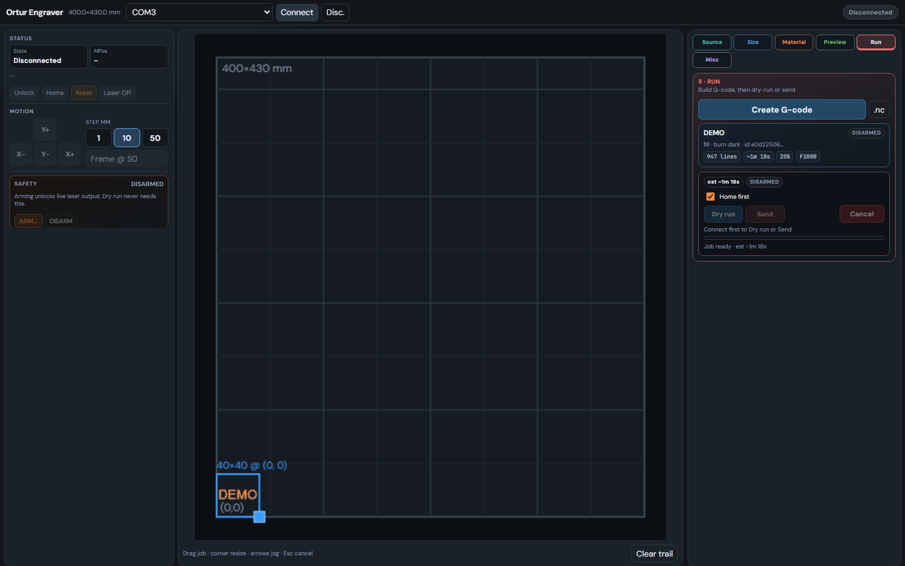

# Ortur Engraver

Local web UI for driving an Ortur (GRBL) diode laser engraver over USB serial. Build jobs from image uploads or a simple canvas, generate G-code, dry-run safely, then arm and send when ready.

**Unofficial community project** — not affiliated with Ortur / Aufero / Longer. Use at your own risk; lasers can injure eyes and start fires.

<p align="center">
  
</p>

## Install (one command)

**Windows** (PowerShell) — needs [Git](https://git-scm.com/download/win) + [Python 3](https://www.python.org/downloads/) on PATH:

```powershell
irm https://raw.githubusercontent.com/PrawWarp/ortur_laser/main/get.ps1 | iex
```

**Raspberry Pi / Linux:**

```bash
curl -fsSL https://raw.githubusercontent.com/PrawWarp/ortur_laser/main/get.sh | bash
```

That clones into `~/ortur_laser` (or `%USERPROFILE%\ortur_laser`), installs deps, and starts the UI at [http://127.0.0.1:8000](http://127.0.0.1:8000).

Later updates / restarts:

| | Windows | Linux / Pi |
|--|---------|------------|
| Update + run | `irm …/get.ps1 \| iex` | `curl …/get.sh \| bash` |
| Just run | `~\ortur_laser\run.ps1` | `~/ortur_laser/run.sh` |
| Just update | `~\ortur_laser\scripts\install.ps1` | `~/ortur_laser/scripts/install.sh` |

Or in the UI: **Settings → Updates → Check / Update & restart** (pulls GitHub `main`, keeps `.env`).

Pi boot service + dialout notes: [docs/pi.md](docs/pi.md).

In the UI: **Find** or **Auto — find laser** → **Connect**. Close LaserGRBL / LightBurn first.

LAN access: **Settings** or **Misc → Available on local network**, or set `LAN_ACCESS=true` in `server/.env` (configured on first-time setup; updates never overwrite `.env`).

## Features

- **Find** / auto-detect the engraver serial port (Windows COM* and Linux `/dev/ttyUSB*` / `ttyACM*`)
- Connect / disconnect (close LaserGRBL / LightBurn first)
- Machine status, unlock, home, reset, laser-off
- Jog and frame at `S0` (no burn)
- **ARM / DISARM** gate — live laser jobs are blocked until armed
- Studio workflow: upload or canvas → size/position → material presets → G-code
- Dry run (forces laser off while streaming) and live send with confirm
- Job progress with elapsed / remaining estimates

Default bed size is **400 × 430 mm** (configurable).

## Safety

Lasers can injure eyes and start fires. Use eyewear rated for your wavelength, never leave a running job unattended, and keep a fire extinguisher nearby.

**Recommended first session (no burn):**

1. **Find** / **Connect** (auto-detect or pick the port)
2. Unlock if the controller is in Alarm
3. Jog / **Frame** a small area at `S0`
4. Create a job → **Dry run (laser off)**
5. Only then **ARM** and **Send** for a live job

Dry run never requires arming. Live send does.

## Configuration

First install runs a short setup and writes `server/.env`. **Updates never overwrite it.**

In the UI: **Settings** edits the same variables (Save & restart / Reset to defaults).

Re-run setup:

```bash
# Linux / Pi
FORCE=1 ~/ortur_laser/scripts/setup-env.sh
```

```powershell
# Windows
~\ortur_laser\scripts\setup-env.ps1 -Force
```

| Variable | Default | Meaning |
|----------|---------|---------|
| `SERIAL_PORT` | `auto` | `auto` probes for GRBL/Ortur; or `COM3` / `/dev/ttyUSB0` / `/dev/ttyACM0` |
| `SERIAL_BAUD` | `115200` | GRBL baud rate |
| `BED_WIDTH_MM` | `400` | Work area width |
| `BED_HEIGHT_MM` | `430` | Work area height |
| `LAN_ACCESS` | `false`* | `true` binds `0.0.0.0` for LAN devices |
| `PORT` | `8000` | HTTP port |

\* Linux/Pi first-time setup defaults LAN to `true`.

## Layout

```
get.ps1 / get.sh           One-line bootstrap (clone → install → run)
run.ps1 / run.sh           Start the UI (installs on first run)
scripts/install.*          Update deps / git pull (keeps .env)
scripts/setup-env.*        First-time .env wizard (or -Force / FORCE=1)
server/run.py              App entry
docs/pi.md                 Raspberry Pi notes
```

## License

MIT — see [LICENSE](LICENSE).
